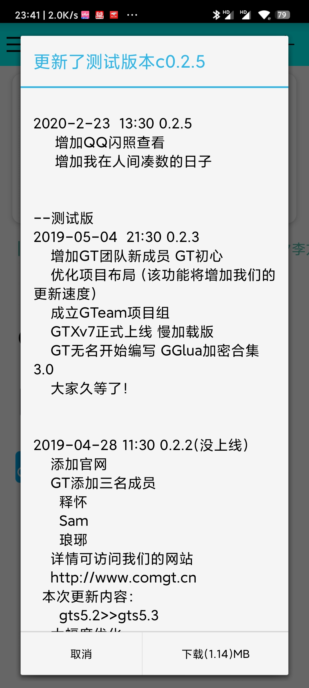
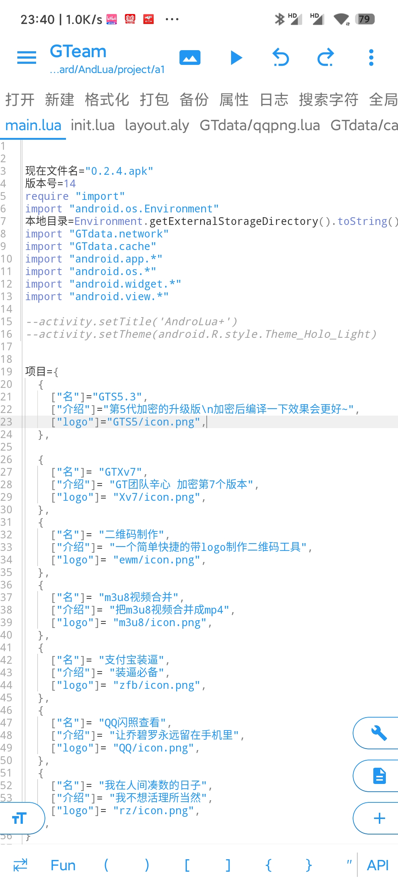

<!--
 * @Author: your name
 * @Date: 2022-02-18 23:32:23
 * @LastEditTime: 2022-02-18 23:45:00
 * @LastEditors: Please set LastEditors
 * @Description: 打开koroFileHeader查看配置 进行设置: https://github.com/OBKoro1/koro1FileHeader/wiki/%E9%85%8D%E7%BD%AE
 * @FilePath: \C_C_++c:\Users\Ytian\Desktop\开发环境\gteam\README.md
-->
# Gteam

#### 介绍
本人高二时，闲得无聊用AndroLua写的一个多工具集合

#### 快速开始
下载并导入Androlua或Andlua

#### 页面展示
* 主页

* 更新界面

* 部分功能

* 部分代码
